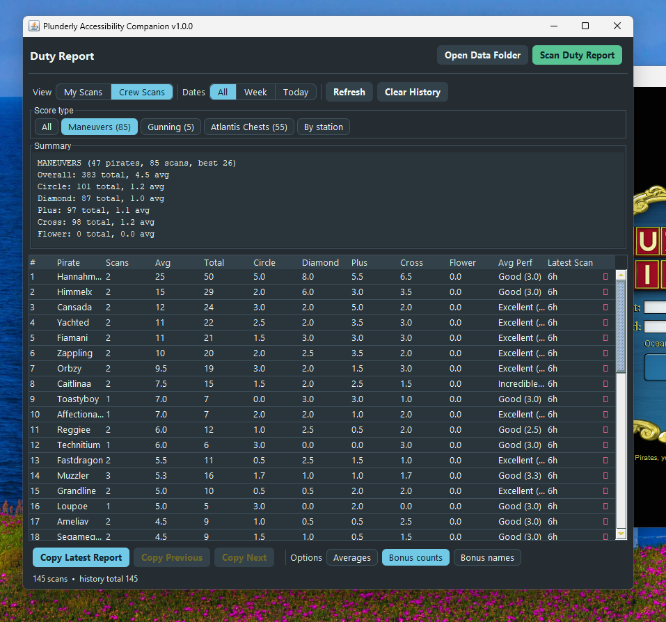

# Plunderly Accessibility Companion

Plunderly Accessibility Companion is a small helper app for **Puzzle Pirates**.
It reads the on-screen **Duty Report** and turns it into clean, easy-to-copy
output: per-pirate stations, ratings, bonus breakdowns, a saved history, and a
simple dashboard.



## How it works

Puzzle Pirates already shares some on-screen information with accessibility
tools, like screen readers. This companion uses that same built-in access to
read the Duty Report and show it in a clearer window.

It does **not** change anything inside the
game itself. Instead it uses `extra.txt` — a standard startup-settings file the
game supports precisely so players can load assistive technology like screen
readers at launch. If you don't have one yet, the installer simply adds it; if
you already do, it appends one line and backs up the original first. Nothing the
game ships is touched. The install does **not**:

- patch, modify, or repackage the game,
- read or alter network traffic,
- change anything about gameplay, or
- automate anything

It only reads information the game already makes available for accessibility and
presents it in a more readable way. The whole change is reversible — the
uninstaller removes the line (or the file) and restores any backup.

### No gameplay advantage

This accessibility companion gives you **no edge in the game**. It cannot touch gameplay,
timing, puzzle inputs, or anything you do while playing.

All it does is take the bonus scores already printed on a Duty Report, that are small and hard to read quickly. It
also keeps a saved history so you can look back later. Every count it shows was
already on your screen.

## Installation

The easiest option is to download the prebuilt zip for your platform from the
[**latest release**](../../releases/latest). Each zip includes the companion
(`plunderly.jar`) and the installer. Unzip it, run the installer, and restart the
game.

### Windows

1. Launch Puzzle Pirates at least once (so its config folder exists), then quit.
2. Download **`plunderly-windows.zip`** and unzip it.
3. Double-click **`Install-Plunderly.cmd`**. The window stays open so you can read
   the result (handy if anything goes wrong). This is the reliable way to run it —
   "Run with PowerShell" can close instantly on machines that block scripts, before
   you see any output.
4. Launch Puzzle Pirates again.

If the installer can't find the game, it will say so and stay open. You can point
it at the game's folder yourself (the one containing the `code` folder — for the
standalone install that's the `app` subfolder) by running the launcher from a
terminal with an extra argument:
`.\Install-Plunderly.cmd -GameDir "C:\Users\you\AppData\Local\Puzzle Pirates\app"`

The companion window appears alongside the game. Because the only install change
is in `extra.txt`, you need to fully restart Puzzle Pirates after installing or
updating so the game can read that file again. The installers are safe to run
again if needed.

### macOS

1. Download **`plunderly-macos.zip`** and unzip it.
2. Double-click **`install.command`**.
   - macOS may block it the first time with an "unidentified developer" warning.
     First try **right-click `install.command` -> Open**, then confirm.
   - On newer macOS the warning has no "Open" button. If so, open **System
     Settings > Privacy & Security**, scroll to the **Security** section where it
     says *"install.command was blocked"*, and click **Open Anyway** — then
     double-click `install.command` again and confirm. You only need to do this
     once.
   - If you see **"macOS blocked the installer from writing inside Puzzle
     Pirates"**, your terminal needs permission to add the startup file. Open
     **System Settings > Privacy & Security > App Management**, turn on the
     switch for **Terminal** (or whichever terminal opened), quit and reopen it,
     then run the installer again. You can turn the switch back off afterward.
3. Quit Puzzle Pirates if it's running, then launch it again.

### Building from source instead

To build it yourself, you need at least **JDK 21**:

```bash
./scripts/build.sh      # compiles src/ and produces dist/plunderly.jar
```

Then run the installer for your platform from `scripts/`, making sure
`plunderly.jar` is **next to the installer script**. The installer expects the
jar beside it.

## Uninstall

Run the matching uninstaller. It reverses the install and restores your backed-up
`extra.txt`:

## License

[MIT](LICENSE).
